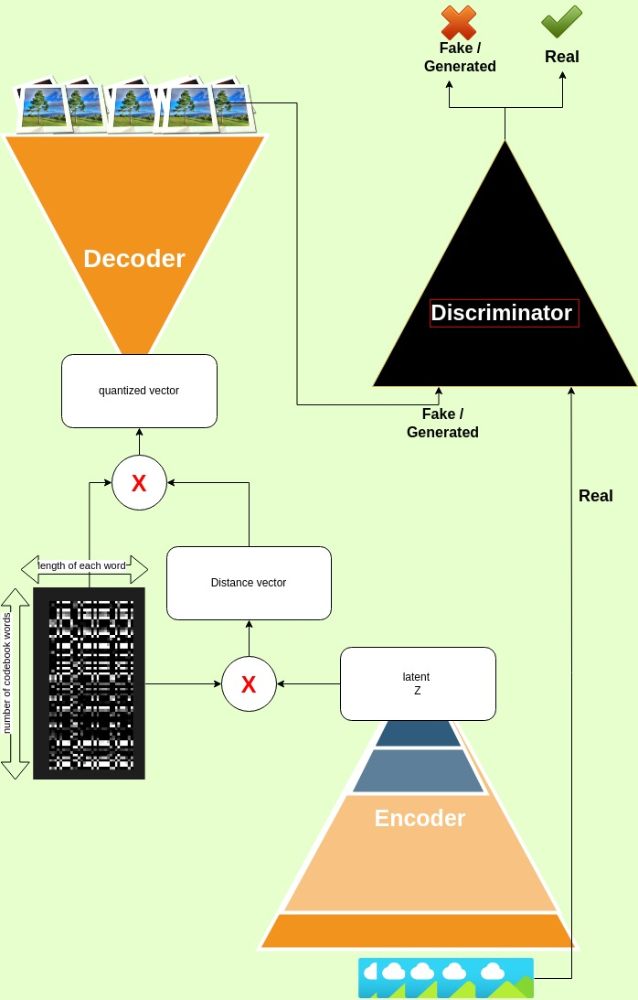
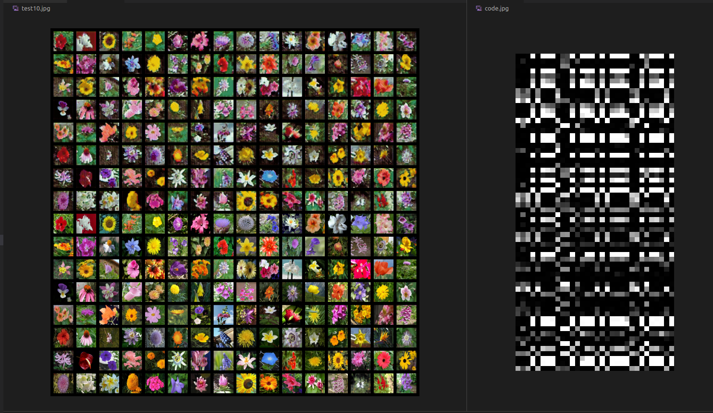

# VQGAN
Vector-Quantized Generative Adversarial Networks:

This repository contains a simple implementaion the code for VQGAN without using Clip : 

a deep neural network architecture that can generate images from it used the basic VQVAE followed by a discriminator .

The model consists of an encoder, a decoder, a vector quantization module and a discriminator .




## Code

The code for VQGan is divided into two parts:

* train folder

* Encoder_decoder_disc_VQ file

### train folder

This folder contains the code for training VQGan on your own dataset. You need to add your dataset to the data folder `called Dataset`.

To train the model, run the following command:

```bash
python train.py
```
### Encoder_decoder_disc_VQ file
This file contains the code for the VQGan model. It has four parts:

* Encoder
* Decoder
* VQ
* Discriminator


#### Encoder

The encoder takes an input image and encodes it into a low-dimensional latent vector.

#### Decoder

The decoder takes the latent vector generated by the encoder and decodes it into an image.

#### VQ

The VQ module is responsible for learning the discrete latent space and providing the quantized latent code for the generator.

#### Discriminator

The discriminator is a neural network that takes an image as input and predicts whether it is real or fake. It is used to train the VQGAN model through adversarial learning.


#### Requirements
The code requires the following packages to be installed:

* torch
* torchvision
* matplotlib
* numpy
* torchsummary
* opencv-python

#### Dataset

MAinly was [102 Category Flower Dataset](https://www.robots.ox.ac.uk/~vgg/data/flowers/102/)

## Results 




